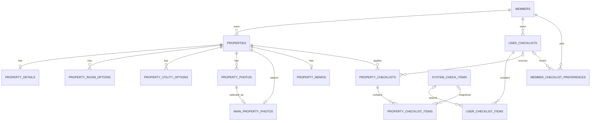

# MVP2 데이터 모델

- 상태: 구현 완료 v1
- 문서 성격: 파생
- 대조 대상: [MVP2 기능 명세](../../../docs/product/specs/README.md), [`001-schema.sql`](../../src/main/resources/db/init/001-schema.sql)
- 갱신 기준: 2026-09-02 통합 ERD 검토

## 원칙

- 제품 정책의 정본은 기능 명세와 [결정 대장](../../../docs/product/decisions/README.md)이다.
- 이 문서는 `001-schema.sql`에서 파생되는 설명 문서다.
- Flyway는 사용하지 않는다. 새 DB는 현재 스키마로 초기화하고 기존 데이터가 있는 DB는 멱등 upgrade SQL로 보강한다.
- 주변 시설 응답은 저장하지 않고 NAVER API HUB 지역 검색 또는 데모 adapter에서 그때 조회한다.
- 계산 결과, 외부 API 응답, 즉시 생성 파일(진행률, PDF)은 별도 테이블로 저장하지 않는다.
- 기존 역할이 유지되는 테이블명·컬럼명은 이후 개편에서도 그대로 사용한다.
- 매물 삭제는 `properties.deleted_at`으로 매물 집합 전체를 논리 삭제한다. FK에 `ON DELETE`를 두지 않으므로 종속 데이터는 물리 삭제하지 않고, 부모 매물의 삭제 상태를 따라 조회 대상에서 제외한다. 객체 저장소 사진처럼 FK로 처리할 수 없는 자원만 애플리케이션이 별도로 삭제한다.
- 매물 이름만 필수이고 주소·좌표·보증금·월세·발견 경로는 선택이다. 보증금·월세 미입력은 0으로 저장한다. 이전 요구사항 문서의 "주소 필수" 표현과 충돌하면 이 저장 정책을 우선한다.
- 체크리스트 생성 시 활성 `CORE` 항목을 자동 포함하되, 이후 전체 수정에서는 사용자가 `CORE` 항목도 제거할 수 있다.

## ERD

## 회원·인증

### `members`

| 컬럼 | 타입 | 제약 | 설명 |
| --- | --- | --- | --- |
| `id` | BIGINT UNSIGNED | PK, AUTO_INCREMENT | 회원 식별자 |
| `nickname` | VARCHAR(50) | NOT NULL, UNIQUE | 로그인에 사용하는 닉네임 |
| `password_hash` | VARCHAR(255) | NULL | 선택 비밀번호 해시. NULL이면 같은 닉네임을 아는 누구나 접근 가능 |
| `created_at`, `updated_at` | DATETIME(6) | NOT NULL | 생성·수정 시각 |

비밀번호 원문은 저장하지 않는다. 별도 자격정보 테이블 없이 `members` 한 테이블로 인증을 처리한다.

## 매물

### `properties`

| 컬럼 | 타입 | 제약 | 설명 |
| --- | --- | --- | --- |
| `id` | BIGINT UNSIGNED | PK, AUTO_INCREMENT | 매물 식별자 |
| `member_id` | BIGINT UNSIGNED | FK, NOT NULL | 소유 회원 |
| `name` | VARCHAR(30) | NOT NULL | trim 후 1~30자 |
| `deposit_amount` | BIGINT UNSIGNED | NOT NULL, DEFAULT 0 | 원 단위 보증금 |
| `monthly_rent_amount` | BIGINT UNSIGNED | NOT NULL, DEFAULT 0 | 원 단위 월세 |
| `address` | VARCHAR(255) | NULL | 주소 |
| `latitude` | DECIMAL(10,7) | NULL, CHECK -90~90 | WGS84 위도 |
| `longitude` | DECIMAL(11,7) | NULL, CHECK -180~180 | WGS84 경도 |
| `created_at` | DATETIME(6) | NOT NULL | 생성 시각 |
| `deleted_at` | DATETIME(6) | NULL | 매물 집합 논리 삭제 시각 |

- `member_id`는 `members.id`를 참조한다.
- `(id, member_id)`는 사진 등 종속 자원의 소유권 검증을 위한 복합 FK 대상으로 UNIQUE다.
- 위도와 경도는 둘 다 NULL이거나 둘 다 값이어야 한다.
- 회원별 활성 매물은 최대 30개다. 동시 생성 시 `members` 행을 잠근 뒤 활성 개수를 검사한다.
- `updated_at`·`last_activity_at` 컬럼은 두지 않는다. 목록은 `id DESC`로 정렬한다.

### `property_details` — 매물 부가정보 (1:1)

| 컬럼 | 타입 | 제약 | 설명 |
| --- | --- | --- | --- |
| `property_id` | BIGINT UNSIGNED | PK, FK | 대상 매물 |
| `available_move_in_date` | DATE | NULL | 입주 가능일 |
| `maintenance_fee_amount` | BIGINT UNSIGNED | NOT NULL, DEFAULT 0 | 관리비 |
| `visit_scheduled_at` | DATETIME(6) | NULL | 방문 예정 시각 |
| `discovery_source` | VARCHAR(500) | NULL | 확인한 곳(URL·앱·중개사 등 발견 경로) |
| `created_at`, `updated_at` | DATETIME(6) | NOT NULL | 생성·수정 시각 |

매물과 최대 1:1 관계다.

### `property_room_options` / `property_utility_options` — 방 옵션·관리비 포함 공과금 (M:N)

| 테이블 | PK | 코드 값 |
| --- | --- | --- |
| `property_room_options` | `(property_id, option_code)` | `AIR_CONDITIONER`, `REFRIGERATOR`, `WASHING_MACHINE`, `SINK`, `GAS_STOVE`, `MICROWAVE`, `SHOE_CABINET`, `WARDROBE`, `BED`, `DESK`, `TV`, `INDUCTION` |
| `property_utility_options` | `(property_id, utility_code)` | `WATER`, `ELECTRICITY`, `GAS`, `INTERNET` |

두 테이블 모두 `property_id`가 `properties.id`를 참조하는 매핑 테이블이다.

`PropertyService`의 생성·수정 로직과 `JdbcPropertyRepository`가 이 세 테이블에 INSERT/UPDATE하며, 매물 생성·수정·조회 응답의 `availableMoveInDate`, `maintenanceFeeAmount`, `visitScheduledAt`, `roomOptions`, `utilityOptions` 필드와 왕복한다.

## 사진

### `property_photos` — 매물 사진 메타데이터

| 컬럼 | 타입 | 제약 | 설명 |
| --- | --- | --- | --- |
| `id` | BIGINT UNSIGNED | PK, AUTO_INCREMENT | 사진 식별자 |
| `property_id` | BIGINT UNSIGNED | FK, NOT NULL | 대상 매물 |
| `storage_key` | VARCHAR(500) | NOT NULL, UNIQUE | 비공개 객체 저장 키 |
| `content_type` | VARCHAR(50) | NOT NULL | 허용된 이미지 MIME 타입 |
| `size_bytes` | BIGINT UNSIGNED | NOT NULL | 파일 크기 |
| `created_at` | DATETIME(6) | NOT NULL | 업로드 완료 시각 |
| `deleted_at` | DATETIME(6) | NULL | 사진 논리 삭제 시각 |

- `(property_id, id)`는 대표 사진의 복합 FK 검증을 위해 UNIQUE다.
- `(property_id, deleted_at, created_at, id)` 인덱스로 활성 사진을 업로드 완료 순서대로 조회한다.
- 허용 형식은 JPEG, PNG, WebP다. HEIC·HEIF는 거부한다. 매물당 30장, 사진당 5MiB는 애플리케이션 정책으로 검증하며 DB CHECK는 아니다.
- 외부 파일 저장과 DB 메타데이터 저장이 모두 성공한 뒤에만 등록 완료로 처리한다.

### `main_property_photos` — 매물 대표 사진

| 컬럼 | 타입 | 제약 | 설명 |
| --- | --- | --- | --- |
| `id` | BIGINT UNSIGNED | PK, AUTO_INCREMENT | 대표 사진 지정 식별자 |
| `property_id` | BIGINT UNSIGNED | FK, NOT NULL, UNIQUE | 대상 매물 |
| `property_photos_id` | BIGINT UNSIGNED | FK, NOT NULL | 대표로 지정한 사진 |
| `updated_at` | DATETIME(6) | NOT NULL | 대표 사진 변경 시각 |

- 기존 컬럼명 `property_photos_id`를 호환성을 위해 유지한다.
- `(property_id, property_photos_id)`는 `property_photos(property_id, id)`를 참조하는 복합 FK다.
- `property_id` UNIQUE로 매물당 대표 사진을 최대 한 장만 허용한다.
- 대표 사진이 없거나 삭제되면 기본 이미지를 표시한다.

## 메모

### `property_memos` — 매물 자유 메모

| 컬럼 | 타입 | 제약 | 설명 |
| --- | --- | --- | --- |
| `id` | BIGINT UNSIGNED | PK, AUTO_INCREMENT | 메모 식별자 |
| `property_id` | BIGINT UNSIGNED | FK, NOT NULL, UNIQUE | 메모 대상 매물 |
| `free_memo` | VARCHAR(2000) | NOT NULL, DEFAULT '' | 자유 메모 |
| `created_at` | DATETIME(6) | NOT NULL | 생성 시각 |

매물 하나에는 자유 메모가 최대 하나 존재한다. 구조화 메모(`property_memo_items`, `system_memo_items`)는 `db/upgrade/006-remove-online-phone-and-structured-memos.sql`로 폐기했다. 입주 가능일·방 옵션·관리비 포함 공과금·방문 일정처럼 구조화 메모가 다루던 항목은 `property_details`·`property_room_options`·`property_utility_options`로 옮겼다.

## 체크리스트

### `system_check_items` — 시스템 체크 항목

| 컬럼 | 타입 | 제약 | 설명 |
| --- | --- | --- | --- |
| `id` | BIGINT UNSIGNED | PK, AUTO_INCREMENT | 시스템 항목 식별자 |
| `stage` | VARCHAR(30) | NOT NULL, CHECK | `ON_SITE`, `PRE_CONTRACT` |
| `item_type` | VARCHAR(20) | NOT NULL, CHECK | `CORE`, `OPTIONAL` |
| `question` | VARCHAR(200) | NOT NULL | 확인 질문 |
| `display_order` | SMALLINT UNSIGNED | NOT NULL | 기본 체크리스트 표시 순서 |
| `created_at` | DATETIME(6) | NOT NULL | 생성 시각 |
| `deleted_at` | DATETIME(6) | NULL | 비활성화 시각 |

- `(stage, deleted_at, item_type, display_order, id)` 인덱스를 단계별 검색과 기본 체크리스트 구성에 사용한다.
- 검색 시 단계는 필수 조건이고 질문 검색어는 선택 조건이다. 결과는 `CORE`, `OPTIONAL` 순으로 정렬한다.
- 비활성 항목은 신규 체크리스트에 추가하지 않지만 기존 사용자 체크리스트와 매물 스냅샷에서는 유지한다.
- 시스템 항목 변경은 기존 사용자 체크리스트나 매물 스냅샷을 자동 변경하지 않는다.
- 3단계였던 `ONLINE_PHONE`(방문 전 온라인·전화)은 제거했다. 현재 단계는 `ON_SITE`, `PRE_CONTRACT` 둘뿐이다.

### `user_checklists` / `user_checklist_items` — 사용자 체크리스트

| 컬럼(`user_checklists`) | 타입 | 제약 | 설명 |
| --- | --- | --- | --- |
| `id` | BIGINT UNSIGNED | PK, AUTO_INCREMENT | 체크리스트 식별자 |
| `member_id` | BIGINT UNSIGNED | FK, NOT NULL | 체크리스트 소유 회원 |
| `name` | VARCHAR(30) | NOT NULL | trim 후 1~30자 |
| `stage` | VARCHAR(30) | NOT NULL, CHECK | 생성 후 변경할 수 없는 단계 |
| `created_at` | DATETIME(6) | NOT NULL | 생성 시각 |
| `deleted_at` | DATETIME(6) | NULL | 논리 삭제 시각 |

| 컬럼(`user_checklist_items`) | 타입 | 제약 | 설명 |
| --- | --- | --- | --- |
| `id` | BIGINT UNSIGNED | PK, AUTO_INCREMENT | 구성 항목 식별자 |
| `user_checklist_id` | BIGINT UNSIGNED | FK, NOT NULL | 소속 사용자 체크리스트 |
| `system_check_item_id` | BIGINT UNSIGNED | FK, NOT NULL | 선택한 시스템 체크 항목 |
| `display_order` | SMALLINT UNSIGNED | NOT NULL | 사용자 지정 표시 순서 |

- 활성 항목은 최소 1개, 최대 30개다.
- 생성 시 같은 단계의 활성 `CORE` 항목을 먼저 자동 포함하되, 이후 전체 수정에서는 `CORE`도 제거할 수 있다.
- `(user_checklist_id, system_check_item_id)`, `(user_checklist_id, display_order)`는 각각 UNIQUE다. 같은 시스템 항목 중복, 다른 단계 항목 혼입을 막는다.
- `system_check_item_id`는 항상 시스템 항목을 참조하는 NOT NULL FK다. 사용자가 직접 문구를 입력하는 `CUSTOM` 항목은 저장할 수 없다. 응답 DTO의 `origin` 필드는 하위 호환을 위해 남아 있지만 항상 `PROVIDED`를 반환한다.
- 삭제된 체크리스트는 목록·상세·수정·신규 적용에서 제외하지만 기존 매물 스냅샷은 유지한다.

### `member_checklist_preferences` — 회원 단계별 최근 선택 체크리스트

| 컬럼 | 타입 | 제약 | 설명 |
| --- | --- | --- | --- |
| `member_id` | BIGINT UNSIGNED | PK, FK | 회원 |
| `stage` | VARCHAR(30) | PK, CHECK | `ON_SITE`, `PRE_CONTRACT` |
| `user_checklist_id` | BIGINT UNSIGNED | FK, NULL | 최근 선택한 사용자 체크리스트. NULL이면 시스템 기본 체크리스트 |
| `updated_at` | DATETIME(6) | NOT NULL | 최근 선택 시각 |

기록이 없거나 대상 체크리스트가 삭제됐으면 해당 단계의 시스템 기본 체크리스트(활성 `CORE`로 구성한 가상 체크리스트)를 사용한다. 매물 생성 또는 단계 최초 적용 시 이 표를 참조한다.

### `property_checklists` / `property_checklist_items` — 매물 적용 체크리스트 스냅샷

| 컬럼(`property_checklists`) | 타입 | 제약 | 설명 |
| --- | --- | --- | --- |
| `id` | BIGINT UNSIGNED | PK, AUTO_INCREMENT | 매물 체크리스트 식별자 |
| `property_id` | BIGINT UNSIGNED | FK, NOT NULL | 적용 대상 매물 |
| `user_checklist_id` | BIGINT UNSIGNED | FK, NULL | 적용에 사용한 사용자 체크리스트. 시스템 기본이면 NULL |
| `checklist_name` | VARCHAR(30) | NOT NULL | 적용 당시 체크리스트 이름 |
| `stage` | VARCHAR(30) | NOT NULL, CHECK | 적용 단계 |
| `created_at`, `updated_at` | DATETIME(6) | NOT NULL | 최초 적용·마지막 교체 시각 |

| 컬럼(`property_checklist_items`) | 타입 | 제약 | 설명 |
| --- | --- | --- | --- |
| `id` | BIGINT UNSIGNED | PK, AUTO_INCREMENT | 매물 체크 항목 식별자 |
| `property_checklist_id` | BIGINT UNSIGNED | FK, NOT NULL | 소속 매물 체크리스트 |
| `system_check_item_id` | BIGINT UNSIGNED | FK, NOT NULL | 원본 시스템 항목 |
| `display_order` | SMALLINT UNSIGNED | NOT NULL | 적용 당시 표시 순서 |
| `status` | VARCHAR(20) | NOT NULL, DEFAULT `UNCONFIRMED`, CHECK | `UNCONFIRMED`, `GOOD`, `CAUTION` |
| `memo` | VARCHAR(500) | NOT NULL, DEFAULT '' | 항목별 메모 |
| `question` | VARCHAR(200) | NOT NULL | 적용 당시 질문 |
| `created_at` | DATETIME(6) | NOT NULL | 스냅샷 생성 시각 |

- `(property_id, stage)`는 UNIQUE로 매물의 단계마다 체크리스트를 최대 하나만 허용한다.
- `user_checklist_id`는 출처 추적용이며 원본이 논리 삭제돼도 스냅샷은 유지한다.
- 적용 시 원본 체크리스트 정보와 시스템 항목 ID·질문·순서를 스냅샷으로 복사한다. 원본이 바뀌거나 삭제돼도 기존 스냅샷은 자동 변경하지 않는다.
- 같은 단계의 체크리스트를 교체하면 동일 `system_check_item_id`의 상태·메모만 승계하고, 새 항목은 `UNCONFIRMED`와 빈 메모로 추가하며, 빠진 항목은 제거한다. 교체 시 모든 적용 항목에 새 `id`를 발급한다.
- 상태와 메모는 독립된 API로 같은 행의 각 컬럼을 갱신한다. 서버는 같은 항목의 같은 API에 대해 마지막으로 정상 처리된 요청을 최종값으로 남긴다.
- 진행 현황은 이 테이블의 `status`를 실시간 집계해 만들며 별도 테이블에 저장하지 않는다. `GOOD`·`CAUTION`은 완료, `UNCONFIRMED`는 미확인이고, 진행률은 `완료 ÷ 전체 × 100`의 정수이며 전체가 0이면 0이다.

## 삭제 정책

FK에 `ON DELETE`를 두지 않아 DB 레벨 CASCADE·SET NULL은 없다. 매물 삭제는 다음 순서로 애플리케이션이 처리한다.

1. `properties.deleted_at`을 기록해 매물을 논리 삭제한다.
2. 사진·부가정보·메모·체크리스트 등 종속 행은 물리 삭제하지 않고, 조회 시 부모 매물의 삭제 상태를 따라 제외한다.
3. 객체 저장소 사진은 FK로 처리할 수 없으므로 storage key 목록을 확보해 별도로 삭제한다. 객체 삭제 실패는 재시도 가능한 실패로 응답하고 DB 변경을 커밋하지 않는다.

## 운영 DB 전용 보강

`db/upgrade/001-nickname-credentials.sql`, `003-adapt-team-mvp1-schema.sql`, `005-member-first-property-created-at.sql`은 팀 운영 RDS에 남아 있던 MVP1(Google 계정, Flyway V11) 데이터를 위 스키마와 호환시키려고 `nickname_credentials`, `members.last_login_at`, `properties.road_address`/`jibun_address`, `members.first_property_created_at`, `property_comparison_view_events` 같은 레거시 컬럼·테이블을 존재 여부 기준으로 추가한다. 이 스크립트는 [ADR-0011](../adr/0011-apply-idempotent-database-upgrades.md)에 따라 새 DB를 포함한 모든 환경에서 매 시작마다 실행되므로, 실제 런타임 스키마는 위에서 설명한 기본 스키마에 이 보강분이 더해진 상태다.

`Member`·`JdbcMemberRepository`·`AuthService`는 `members.nickname`·`members.password_hash`만 읽고 쓴다. `nickname_credentials` 테이블과 `members.email`·`members.name`·`members.last_login_at`·`members.first_property_created_at` 컬럼은 이제 애플리케이션 코드가 읽거나 쓰지 않는다. 위 세 upgrade 스크립트는 [ADR-0011](../adr/0011-apply-idempotent-database-upgrades.md)의 "배포된 upgrade SQL은 수정하지 않는다" 원칙에 따라 그대로 두지만, 이 테이블·컬럼은 팀 RDS의 과거 데이터를 보존하는 이력일 뿐 현재 도메인 모델의 일부가 아니다. 생애 첫 매물 표시(`firstProperty`)처럼 `first_property_created_at`에 의존하던 기능은 컬럼이 기본 스키마에 없어 현재 제공하지 않는다. 새로운 도메인 설계는 이 문서의 기본 스키마를 기준으로 한다.

## 초기화와 시드

- `001-schema.sql`: 새 DB용 전체 스키마 한 벌
- `002-seed.sql`: 두 단계의 시스템 체크 항목과 데모에 필요한 최소 기준 데이터
- `db/upgrade/*.sql`: 번호순으로 반복 적용 가능한 순방향 보강 SQL. 애플리케이션 시작마다 전체를 실행한다.
  - `001-nickname-credentials.sql`: 팀 RDS의 기존 회원에 닉네임 자격정보를 보강
  - `002-custom-checklist-items.sql`: 이전 버전의 직접 질문 출처를 보존하고 제공 문항을 재정비
  - `003-adapt-team-mvp1-schema.sql`: 팀 RDS의 Flyway V11 형태를 데이터 손실 없이 보강
  - `004-property-comparison-view-events.sql`: 비교 화면 진입 이벤트 테이블을 멱등 추가
  - `005-member-first-property-created-at.sql`: 회원의 최초 매물 생성 시각을 보강
  - `006-remove-online-phone-and-structured-memos.sql`: `ONLINE_PHONE` 단계와 구조화 메모(`property_memo_items`, `system_memo_items`) 데이터·테이블을 제거하고 단계 CHECK 제약을 `ON_SITE`, `PRE_CONTRACT` 둘로 축소. 리팩터링 이전 볼륨에는 없는 `member_checklist_preferences`를 먼저 `CREATE TABLE IF NOT EXISTS`로 보장한다.
  - `007-add-property-detail-tables.sql`: 리팩터링 이전 볼륨·RDS에 `property_details`, `property_room_options`, `property_utility_options`를 `001-schema.sql`과 동일한 정의로 보강
- 데모 회원·매물·진행 결과는 `DEMO_SEED_ENABLED=true`일 때만 만들며 운영 시드에 섞지 않는다.
