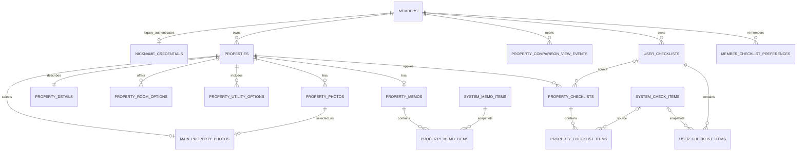

# MVP2 데이터 모델

- 상태: 통합 스키마 전환 중
- 문서 성격: 파생
- 대조 대상: [MVP2 기능 명세](../../../docs/product/specs/README.md), [`db/migration`](../../src/main/resources/db/migration/), [데이터베이스 초기화](../guides/database-initialization.md)

## 원칙

- 제품 정책의 정본은 기능 명세와 [결정 대장](../../../docs/product/decisions/README.md)이다.
- 이 문서는 Flyway V1 기준선과 V3~V5 통합 마이그레이션에서 파생되는 현재 모델 설명이다.
- 통합 마이그레이션은 먼저 새 컬럼과 테이블을 추가하고 기존 데이터를 backfill한다. API 전환과 검증이 끝나기 전까지 레거시 컬럼은 호환을 위해 남긴다.
- 주변 시설 응답은 저장하지 않고 NAVER API HUB 지역 검색 또는 데모 adapter에서 그때 조회한다.

## ERD

## 회원과 인증 정보

`members`는 소유 관계를 유지하는 내부 회원이다. 통합 모델은 닉네임과 인증 hash를 같은 행에 두며, `nickname_key`는 binary collation의 nullable unique 값으로 둔다. V4는 기존 `nickname_credentials`가 실제로 가진 값만 복사하고, 자격정보가 없는 회원을 비밀번호 없는 계정으로 자동 전환하지 않는다. `nickname_credentials`는 API 전환이 끝날 때까지 레거시 읽기·검증용으로 보존한다.

| `members` 컬럼 | 타입 | 제약 | 설명 |
| --- | --- | --- | --- |
| `nickname` | VARCHAR(100) | NULL (전환 중) | 화면 표시 닉네임 |
| `nickname_key` | VARCHAR(100) | NULL, UNIQUE, binary collation | 닉네임 중복 검사 key |
| `password_hash` | VARCHAR(100) | NULL, ASCII binary | 기존 BCrypt hash. 원문을 다시 해시하지 않음 |

기존 `email`, `name`, 소유 FK는 유지한다. `last_login_at`, `first_property_created_at`, `updated_at`은 현재 전환 단계에서 신규 로직이 참조하지 않으며 API cutover 후 별도 정리한다.

## MVP2의 `properties`

| 컬럼 | 타입 | 제약 | 설명 |
| --- | --- | --- | --- |
| `id` | BIGINT | PK, AUTO_INCREMENT | 매물 ID |
| `member_id` | BIGINT | FK, NOT NULL | 소유 회원 |
| `name` | VARCHAR(50) | NOT NULL | 애플리케이션 제한 30자 |
| `deposit_amount` | BIGINT | NOT NULL, DEFAULT 0 | 원 단위 보증금 |
| `monthly_rent_amount` | BIGINT | NOT NULL, DEFAULT 0 | 원 단위 월세 |
| `address` | VARCHAR(500) | NULL | 도로명 우선, 없으면 지번 주소를 복사한 표시 주소 |
| `discovery_source` | VARCHAR(500) | NOT NULL, DEFAULT '' (레거시) | 통합 후 `property_details`로 복사 |
| `road_address` | VARCHAR(255) | NULL | 대표 도로명 주소 |
| `jibun_address` | VARCHAR(255) | NULL | 지번 주소 |
| `latitude` | DECIMAL(10,7) | NULL | WGS84 위도 |
| `longitude` | DECIMAL(11,7) | NULL | WGS84 경도 |
| `created_at` | DATETIME(6) | NOT NULL | UTC 생성 시각 |
| `deleted_at` | DATETIME(6) | NULL | 논리 삭제 시각 |

### 제약과 인덱스

- 위도와 경도는 둘 다 NULL이거나 둘 다 값이어야 한다.
- `CHECK(latitude BETWEEN -90 AND 90)`, `CHECK(longitude BETWEEN -180 AND 180)`를 둔다.
- 기본 목록은 `created_at DESC, id DESC`로 정렬하고 활성 행(`deleted_at IS NULL`)만 조회한다.
- `(member_id, deleted_at, created_at DESC, id DESC)` 인덱스를 둔다.
- `(id, member_id)` UNIQUE는 사진 소유자 복합 FK를 위해 유지한다.
- 주소가 없는 MVP1 행은 주소와 좌표를 NULL로 둔다.

## 매물 부가정보와 선호 체크리스트

`property_details`는 매물당 하나의 행으로 입주 가능일, 관리비, 방문 일정, 확인한 곳을 저장한다. `maintenance_fee_amount`가 관리비 금액의 정본 컬럼명이다. 방 옵션과 관리비에 포함된 공과금은 코드 연결 테이블로 분리하며 두 테이블 모두 `(property_id, code)` 복합 PK를 사용한다.

| 테이블 | 컬럼 | 제약 | 설명 |
| --- | --- | --- | --- |
| `property_details` | `property_id` | PK, FK, CASCADE | 매물과 1:1 연결 |
|  | `available_move_in_date` | DATE, NULL | 입주 가능일 |
|  | `maintenance_fee_amount` | BIGINT UNSIGNED, NULL | 관리비 금액(원) |
|  | `visit_scheduled_at` | DATETIME(6), NULL | 방문 예정 시각 |
|  | `discovery_source` | VARCHAR(500), NULL | 확인한 곳 |
| `property_room_options` | `(property_id, option_code)` | 복합 PK, FK | 허용된 방 옵션 코드 |
| `property_utility_options` | `(property_id, utility_code)` | 복합 PK, FK | `WATER`, `ELECTRICITY`, `GAS`, `INTERNET` |

`member_checklist_preferences`는 회원이 단계별로 마지막에 선택한 사용자 체크리스트를 append-only로 기록한다. 매물 생성 트랜잭션은 `ON_SITE`, `PRE_CONTRACT` 각각의 최신 행을 조회하고, 없으면 시스템 기본 체크리스트를 적용한다. `ONLINE_PHONE`은 새 preference 행에 저장하지 않는다.

## 비교 화면 진입 이벤트

`property_comparison_view_events`는 비교 화면을 연 회원과 시각, 그 시점의 보유 매물 수를 사실 기록으로 남긴다. 매물 수를 이벤트에 스냅샷하므로 사용자가 뒤에 매물을 삭제해도 `2개 이상 매물을 등록한 뒤 비교 화면에 도달`한 여부가 바뀌지 않는다.

| 컬럼 | 타입 | 제약 | 설명 |
| --- | --- | --- | --- |
| `id` | BIGINT UNSIGNED | PK, AUTO_INCREMENT | 진입 이벤트 ID |
| `member_id` | BIGINT | FK, NOT NULL, CASCADE | 비교 화면을 연 회원 |
| `property_count` | SMALLINT UNSIGNED | NOT NULL, CHECK 0~30 | 진입 시점의 보유 매물 수 |
| `viewed_at` | DATETIME(6) | NOT NULL | UTC 진입 시각 |

`(member_id, viewed_at, id)`는 회원별 첫 진입·반복 진입 조회에, `(property_count, viewed_at, id)`는 2개 이상 보유 진입 집계에 사용한다. 회원을 삭제하면 이벤트도 cascade 삭제한다.

## 대표 사진 정합성

`main_property_photos.property_id`를 UNIQUE로 만들어 매물당 대표 사진을 하나만 허용한다. 대표 사진 행의 사진이 같은 매물 소속임을 서비스와 복합 FK로 함께 보장한다. `property_photos.deleted_at`은 사진 메타데이터의 논리 삭제 시각이며, 외부 객체 정리는 별도 작업으로 수행한다.

- 첫 사진 업로드: 대표 관계가 없으면 삽입
- 대표 변경: 매물 행 잠금 뒤 upsert 또는 delete·insert
- 대표 삭제: 남은 `created_at, id` 첫 사진으로 교체
- 마지막 사진 삭제: 대표 관계 제거

## 삭제 정책

| 부모 | 자식 | 정책 |
| --- | --- | --- |
| `members` | 레거시 닉네임 자격정보·선호 기록 | `ON DELETE CASCADE` |
| `properties` | 사진·대표 사진·메모·매물 체크리스트·부가정보·옵션 | 물리 삭제 시 `ON DELETE CASCADE`, API cutover 후 `deleted_at` 논리 삭제 |
| `property_memos` | 메모 항목 | `ON DELETE CASCADE` |
| `user_checklists` | 사용자 항목 | 물리 삭제 시 `ON DELETE CASCADE`, API cutover 후 `deleted_at` 논리 삭제 |
| `user_checklists` | 매물 체크리스트 출처 | `ON DELETE SET NULL` |
| `property_checklists` | 매물 체크 항목 | `ON DELETE CASCADE` |

객체 저장소는 FK가 처리할 수 없으므로 매물 삭제 전에 storage key 목록을 확보하고 객체를 삭제한다. 일부 객체 삭제 실패는 재시도 가능한 실패로 응답하고 DB 삭제를 커밋하지 않는다.

## 목록 정렬과 삭제 조회

통합 API의 목록 기본 정렬은 `properties.created_at DESC, properties.id DESC`다. API cutover가 끝나면 모든 매물 조회·개수·소유권 검사에 `deleted_at IS NULL`을 기본 조건으로 사용한다. 현재 마이그레이션 브랜치는 컬럼과 인덱스만 추가하며 기존 API의 물리 삭제·레거시 정렬은 후속 cutover 작업에서 전환한다. 전환 후 삭제 요청은 `deleted_at`만 기록하고 사진 객체와 종속 행은 후속 정리 정책에 따라 보존한다.

## 유지하는 스냅샷

- `user_checklist_items`는 제공 항목의 시스템 ID·단계·유형·질문·순서를 복사한다.
- `property_checklist_items`는 시스템 ID·질문·순서·상태·메모를 복사한다.
- `property_memo_items`는 전환 기간 동안 기존 구조화 메모의 원본과 스냅샷을 보존한다.
- 원본의 변경·비활성화는 기존 스냅샷을 자동 변경하지 않는다.

V4는 기존 구조화 메모에서 변환 가능한 값을 `property_details`와 코드 테이블로 복사한다. 원문을 해석할 수 없으면 NULL과 실패 목록을 남기며 `property_memos.free_memo`는 변경하지 않는다.

`user_checklist_items.system_check_item_id`와 `property_checklist_items.system_check_item_id`는 이전 버전의 직접 질문 스냅샷을 보존하기 위해 물리적으로 NULL을 허용하지만 신규 생성·수정 계약은 제공 시스템 ID를 요구한다. 이전 `CUSTOM` 항목은 문구를 바꾸지 않은 유지·정렬·제거만 허용한다. 체크리스트 교체 시 제공 항목은 시스템 ID로 상태·메모를 승계하고 사용자 체크리스트 안에서는 시스템 ID 중복을 금지한다.

## 초기화와 시드

- `V1__baseline_mvp2_schema.sql`: 현재 런타임이 사용하던 기준 스키마
- `V2__seed_mvp2_reference_data.sql`: 시스템 체크 항목과 다섯 가지 매물 부가정보 항목
- `V3__expand_integrated_schema.sql`: 회원 인증 정보 병합을 위한 nullable 컬럼, 주소·논리 삭제 컬럼, 부가정보·옵션·선호 테이블
- `V4__backfill_integrated_schema.sql`: 기존 주소·인증·구조화 메모 backfill과 변환 실패 기록
- `V5__align_property_address_length.sql`: 통합 주소 컬럼을 500자로 확장
- `integrated_schema_history`: 새 Flyway 이력 테이블. 과거 `flyway_schema_history`는 보존한다.
- 데모 회원·매물·진행 결과는 `DEMO_SEED_ENABLED=true`일 때만 만들며 운영 시드에 섞지 않는다.
